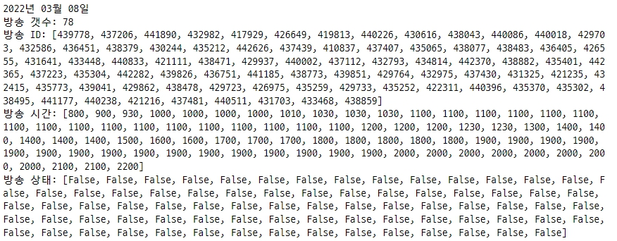
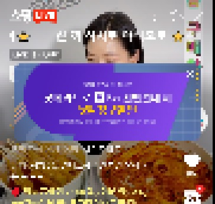

# Shopping Live Viewer

## 1. 내용

### 1.1 배경/목적
- 특정 방송을 시청하고 채팅을 쓰면 50원~150원을 지급함
- 매일 방송 일정을 읽어와서 시작시간이 되면 자동으로 방송을 켜고 채팅을 작성하고 창을 닫아 종료함

### 1.2 기능 및 특징
- 방송 캘린더 크롤링, 로그인, 방송 시작/종료 등 자동화
- 방송 시작시 기존의 창과 겹치지 않도록 오픈
- 방송진입시 배너닫기
- 방송 내 채팅창 등 이펙트 효과 없애 리소스 최소화
- 일정 시간 내 채팅 2번 자동 입력

### 1.3 참고사항
- CPU, 그래픽카드 리소스를 많이 차지함
- 지급 금액이 너프된 이후로 효율성이 떨어짐
- 방송 시청시 화면가림 등으로 다른 작업 하기가 쉽지않음
- 다른 곳에 Viewer로 활용할 수도 있을듯

## 2. 테스트 화면

### 2.1 네이버 쇼핑 라이브

### 2.2 아프리카TV

